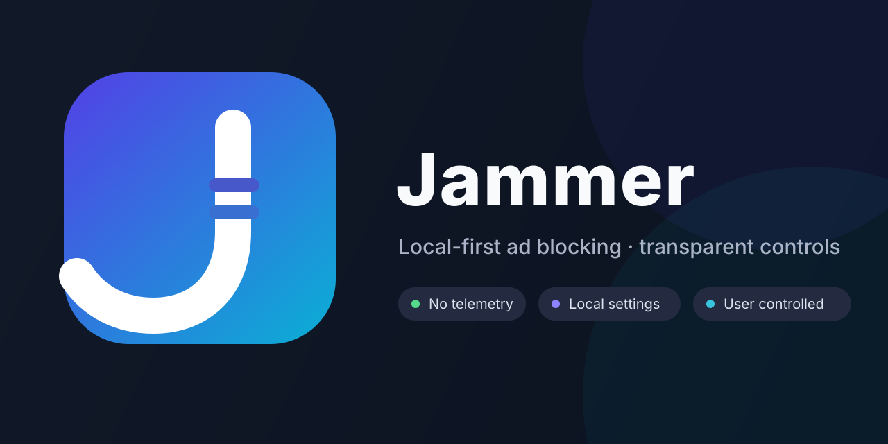

# Jammer

Jammer is a local-first Manifest V3 browser extension for blocking network ads and hiding page ad containers with explicit, reversible user controls.

## Current capabilities

- **Network ad blocking:** pinned EasyList source compiled at build time into deterministic `declarativeNetRequest` rules.
- **Page ad cleanup:** optional CSS-only cosmetic filtering using packaged selectors.
- **Bilingual UI:** Auto / 中文 / English.
- **Branded options cover:** packaged Jammer artwork shown locally inside the extension settings UI.
- **Local allowlist:** exact-domain and subdomain exclusions stored only in extension storage.
- **Reversible permissions:** page cleanup requests optional site access only when enabled and removes it when disabled.
- **No telemetry:** no analytics, account system, cloud sync, or runtime filter-list download.

## Privacy policy

Public bilingual policy: [PRIVACY.md](PRIVACY.md)

Standalone page source: [`docs/privacy/index.html`](docs/privacy/index.html)

## Privacy and permission model

Required permissions:

```text
declarativeNetRequest
storage
```

Optional permissions used only for page ad cleanup:

```text
scripting
http://*/*
https://*/*
```

Jammer does not request `tabs`, `history`, `cookies`, `webRequest`, `debugger`, or `nativeMessaging`.

## Build

Development build:

```bash
npm ci
npm run build
```

Full pinned-EasyList product build:

```bash
npm run build:product
```

Output:

```text
dist-product/
```

Brand assets:

```bash
npm run brand:generate
npm run brand:preview
```

The social-preview generator produces a 1280×640 PNG under `generated/brand/social-preview.png`. The vector source is kept at `assets/brand/social-preview.svg`.

## Release candidate

Build and audit the installable Chromium ZIP:

```bash
npm run release:rc
```

The audited files are written under `release/`. See [P5.4 release packaging](docs/P54_RELEASE_PACKAGING.md).

## Filter provenance

Jammer pins reviewed EasyList source files to a specific upstream commit and verifies source identity before product compilation. Generated product builds include:

- `PROVENANCE.json`
- `COSMETIC_PROVENANCE.json`
- `THIRD_PARTY_NOTICES.txt`

The extension does not update filter lists at runtime.

## Design principles

- **Local first.** User settings and filtering behavior stay on-device.
- **Minimal required permissions.** Broad site access is optional, not required at install.
- **Explainable and reversible.** Protection, page cleanup, language, and allowlist are explicit controls.
- **Browser-native enforcement.** Network blocking uses Chromium's DNR engine rather than a proxy or interception layer.
- **No remote code.** Runtime logic and filtering resources are packaged with the extension.

## Documentation

- [Product specification](docs/P0_PRODUCT_SPEC.md)
- [Permission model](docs/PERMISSION_MODEL.md)
- [Filtering architecture](docs/FILTERING_ARCHITECTURE.md)
- [Threat model](docs/THREAT_MODEL.md)
- [Privacy design](docs/PRIVACY.md)
- [P3.5 EasyList product integration](docs/P35_PRODUCT_EASYLIST.md)
- [P4.1 cosmetic filtering](docs/P41_COSMETIC_FILTERING.md)
- [P4.2 bilingual popup](docs/P42_BILINGUAL_POPUP.md)
- [P4.3 EasyList cosmetic filtering](docs/P43_EASYLIST_COSMETIC.md)
- [P5.5 cover integration](docs/P55_COVER_INTEGRATION.md)
- [P5.6 store listing preparation](docs/P56_STORE_LISTING.md)
- [P5.7 privacy policy](docs/P57_PRIVACY_POLICY.md)
- [Security](SECURITY.md)

## Status

The current product build is intended for unpacked-extension testing and validation. Store publication remains a separate release step.
